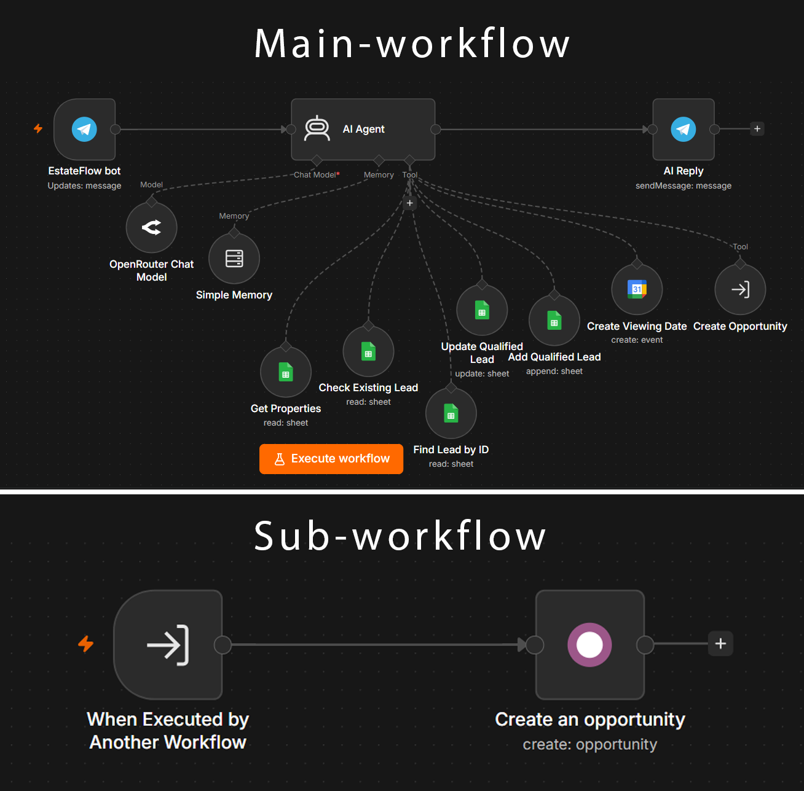

# EstateFlow — AI-Powered Real Estate Lead Automation (n8n)

An end-to-end AI automation built with **n8n** that turns a Telegram chatbot into a full real estate sales assistant — qualifying leads, scheduling property viewings, and creating opportunities in **Odoo CRM**, all without manual data entry.

## What It Does

A prospective buyer messages the Telegram bot. From there, the AI Agent handles the entire conversation and decides which actions to take:

1. **Understands the customer's needs** — property type, location, budget, number of bedrooms, and purpose (buy/rent).
2. **Reads available properties** live from a Google Sheet and presents matching options.
3. **Qualifies the lead** — budget ≥ 1,000,000 EGP is considered Qualified.
4. **Logs or updates the lead** in Google Sheets (checks for an existing lead first to avoid duplicates — adds a new row if it's a new contact, updates the existing row if the contact has messaged before).
5. **Books a viewing date** in Google Calendar if the customer wants to schedule a visit.
6. **Creates an Opportunity in Odoo CRM** — only for qualified leads, through a dedicated sub-workflow.
7. **Replies to the customer** on Telegram with a natural, conversational response.

## Tech Stack

| Tool | Role |
|---|---|
| **n8n** | Workflow orchestration |
| **Google Gemini** | LLM powering the AI Agent |
| **Telegram Bot API** | Customer-facing chat interface |
| **Google Sheets** | Properties database + Leads CRM sheet |
| **Google Calendar** | Viewing appointment scheduling |
| **Odoo** | CRM — Opportunity creation for qualified leads |

## Architecture

The project is split into **two workflows**:

- **`estateflow-main.json`** — the primary workflow: Telegram trigger → AI Agent (with tools) → Telegram reply.
- **`estateflow-odoo-subworkflow.json`** — a dedicated sub-workflow triggered via *Execute Workflow* that handles Odoo Opportunity creation, including input validation (phone/email format checks) before writing to Odoo.

Using a sub-workflow for the Odoo step (instead of a native tool) works around the lack of a built-in "Odoo Tool" node in n8n's AI Agent — the AI Agent calls it like any other tool via `$fromAI()` parameters, and it only fires when a lead is genuinely qualified.

## Key Engineering Details

- **Tool-gated actions** — every write action (Add Lead, Book Viewing, Create Opportunity) is exposed to the AI Agent as a callable *tool*, not a fixed pipeline step, so the AI decides *if and when* to use it based on prompt-defined qualification rules.
- **Duplicate prevention** — a `Check Existing Lead` lookup runs before writing, so returning customers update their existing row instead of creating duplicates.
- **Data sanitization** — phone numbers and budget figures are cleaned with regex expressions before reaching Odoo, since the AI Agent may return them in inconsistent formats (dashes, commas, currency symbols).
- **Input validation** — the Odoo sub-workflow validates phone/email format before attempting to create a record, preventing invalid Odoo writes.
- **Error resilience** — retry logic and a dedicated error-alert workflow notify on failures instead of silently dropping a lead.

## Setup

1. Import both JSON files into your n8n instance.
2. Reconnect the credentials for: Telegram, Google Gemini, Google Sheets, Google Calendar, and Odoo (all credential fields are set to placeholders in these files).
3. Update the Google Sheets document IDs and the Google Calendar account to point to your own sheet/calendar.
4. In `estateflow-main.json`, update the sub-workflow reference (`Execute Workflow` node) to point to your imported copy of `estateflow-odoo-subworkflow.json`.
5. Activate both workflows.

## Screenshots

See the `screenshots/` folder for the full workflow layout in the n8n editor.

---

Built as a portfolio project demonstrating AI Agent tool orchestration, CRM integration, and production-grade error handling in n8n.
